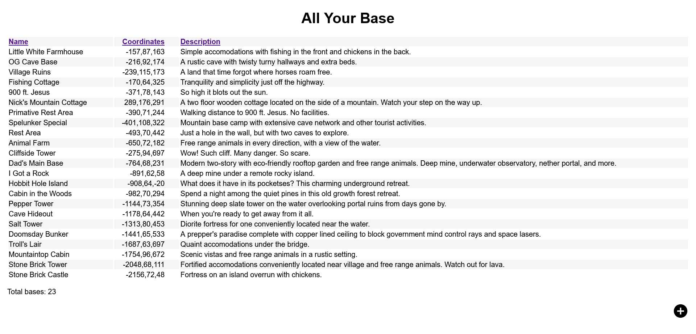

# all-your-base
Keep track of Minecraft bases with this simple Node.js Express app.

Run it like this:
1. Install Node.js using the package manager for your operating system.
2. Install Express.js witht he command: `npm install express`
3. Optionally generate TLS certificate server.crt and server.key.
4. Run the all-your-base API with the command: `nohup ./api.js &`
5. Open a web browser on port 2101. (e.g. https://myserver:2101)

Features:
* Sortable columns by clicking headings in web interface.
* All data kept in human-readable JSON file.
* Reload JSON from file after hand edits with `kill -HUP <PID>`.

Screenshot:

